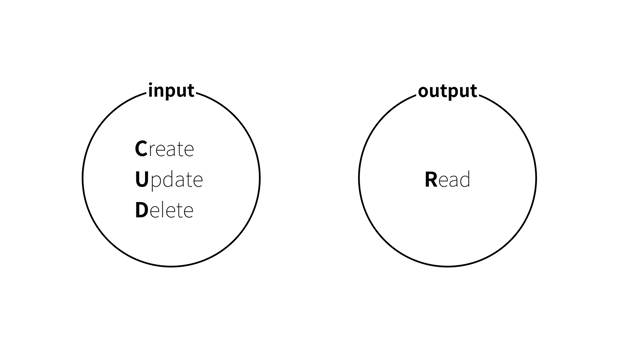

# Database

- 데이터베이스의 입력(Input)과 출력(Output)은 CUD와 R로 이뤄진다.
- 데이터를 다룰 때 필요한 대부분의 동작은 CRUD로 끝난다.

[DB-Engines Ranking](https://db-engines.com/en/ranking)에서 데이터베이스 인기 순위 확인 가능.

## 관계형 데이터베이스(Relational Database)

데이터를 분리하고 데이터 간의 관계를 설정한다는 의미에서 관계형 데이터베이스라는 이름이 붙여짐.

### 왜 나왔을까?

데이터베이스의 **데이터의 중복**이라는 문제를 해결하기 위해 만들어짐.

- 데이터가 중복되면
  - 메모리 및 스토리지 용량의 낭비를 가져옴.
  - 데이터 수정 및 삭제 시 모든 데이터를 고쳐야 함.

이를 해결하기 위해 한 테이블 내에서 중복되는 필드들을 분리하고, 분리된 데이터의 식별자만 원래 테이블 데이터에 넣어서 연결. 예를 들면 게시판 게시물과 게시자의 정보를 들 수 있음.

- 장점
  - 물리적 공간의 낭비를 줄일 수 있음.
  - 한 곳만 수정하면 되므로 유지보수가 매우 편함.
- 단점
  - 조회 시 연관된 데이터를 찾아야 함.
  - 연결되지 않은 데이터를 보면 직관적이지 않음.

### 더 공부해봐야할 것

- [ ] Index
- [ ] Modeling
- [ ] Backup: mysqldump, binary log
- [ ] Cloud: AWS RDS, Google Cloud SQL, AZURE Database

## Index

| Link                      | Tags                       |
| ------------------------- | -------------------------- |
| [MySQL](MySQL.md)         | `database` `sql` `backend` |
| [SQL JOINs](SQL-JOINs.md) | `database` `sql` `backend` |

# 참고자료

[DATABASE1 - 생활코딩](https://opentutorials.org/course/3162)
[데이터베이스의 본질 | DATABASE1 - 생활코딩](https://opentutorials.org/course/3162/19527)
[file vs database | DATABASE1 - 생활코딩](https://opentutorials.org/course/3162/19528)
