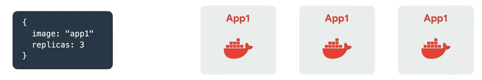
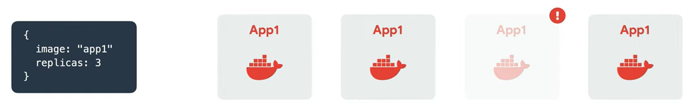
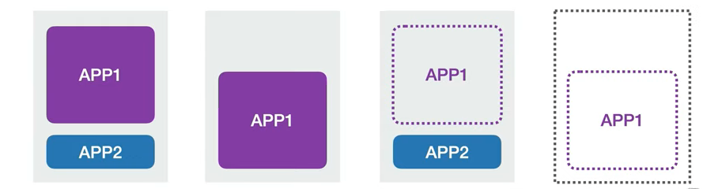
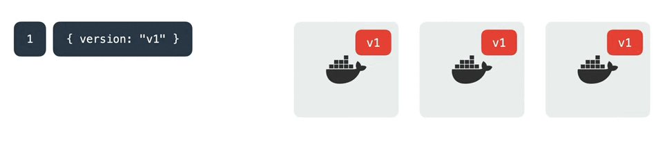
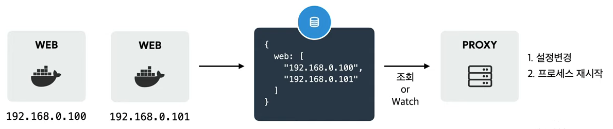
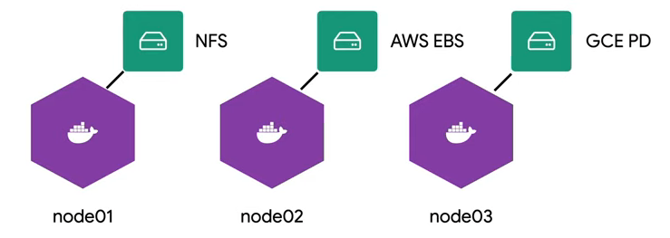

# Container Orchestration

서버의 상태를 관리하기 위한 노력

## 서버 관리를 더 쉽게하기 위한 노력들

언제 이슈가 터질 지 모르고, 인수인계도 어려움. 그래서 여러가지 노력들이 있었다!

1. 문서화를 잘 해보자!
   - 모든 내용을 문서화하기 힘들고 변경 관리, 최신화 등이 너무 어려움
1. 서버 관리도구(CHEF, Ansible, Puppet labs) 사용
   - 도구에 대한 학습이 필요
   - 서버 설정이 복잡해지면 도구 사용의 난이도가 올라감
1. 가상머신(VM, Virtual Machine)
   - 클라우드 환경과 안 맞는 부분이 있음
   - 특정 벤더에 종속성이 생김
   - 기본적으로 좀 느림
1. 컨테이너(Docker)
   - VM 보다 컨테이너 생성이 쉽고 효율적
   - 컨테이너 이미지를 이용한 배포와 롤백이 간단함
   - 언어, 프레임워크와 상관없이 애플리케이션을 동일한 방식으로 관리
   - 개발, 테스팅, 운영환경은 물론 로컬 PC와 클라우드까지 동일한 환경 구축
   - 특정 벤더에 종속적이지 않음

**컨테이너 등장 후 개발 프로세스**

> Develop - Build - Ship - Run

### 그런데... 서비스를 위한 컨테이너가 늘어나며 컨테이너도 관리가 필요해진다!

- 컨테이너 배포, 롤백
- 서비스 검색을 위한 로드밸런서 셋팅
- 서비스 노출을 위한 게이트웨이 셋팅
- 서비스 이상, 부하 모니터링
- 부하 증가 시 스케일아웃

서버 관리자의 일을 컨테이너 오케스트레이션 도구가 대신 해줌. ~~근데 아이러니하게도 컨테이너 오케스트레이션을 위한 서버 관리자의 업무가 더 늘어날 수 있음ㅋㅋ~~

## Container Orchestration의 특징

### Cluster

각각 관리했던 노드들을 클러스터로 합쳐 추상화해서 관리.

- 중앙제어: 관리자는 마스터 노드를 이용해 클러스터에 명령 전달
- 네트워킹: 가상네트워크 구성 등을 통해 클러스터 내부 노드들끼리 통신이 잘 되어야함
- 노드 스케일: 클러스터 내부의 노드가 얼마든지 늘어나도 잘 동작해야함

### State(상태 관리)

서버관리자가 설정해 놓은 상태대로 서버의 상태가 유지되는 것

#### 서버 실행 시

노드마다 명령을 내리지 않아도 선언해놓은 값대로 컨테이너 3개 실행

#### 서버 장애 시

한 컨테이너에 문제가 생기면 알아서 새 컨테이너를 실행

### Scheduling

새 컨테이너를 하나 더 실행하고 싶을 때 어느 노드에 여유가 있는지 파악하고 배치하고, 여유있는 노드가 없으면 노드를 추가함

### Rollout/Rollback

컨테이너의 배포 버전을 하나하나 관리하는 것이 아닌 중앙에서 관리

### Service Discovery

컨테이너가 추가되고 IP가 할당되면 중앙의 서버나 저장소에 등록하고, 이런 변경사항이 생기면 프록시 서버의 설정을 변경하고 프로세스를 재시작

### Volume Storage

노드마다 필요한 스토리지를 직접 연결할 필요가 없음.

# Reference

[[초보를 위한 쿠버네티스 안내서] 컨테이너 오케스트레이션이란?](https://www.youtube.com/watch?v=Ia8IfowgU7s&list=PLIUCBpK1dpsNf1m-2kiosmfn2nXfljQgb)
