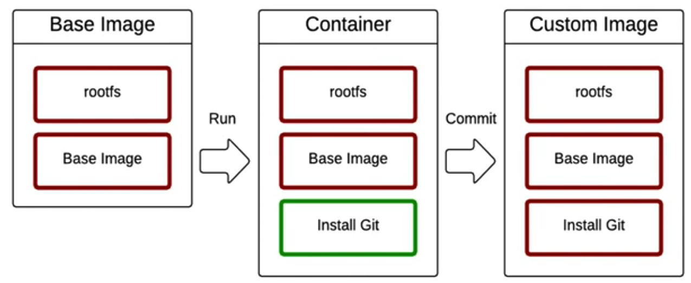

# Docker

컨테이너 기반의 오픈소스 가상화 플랫폼

> [Container란?](container.md)

docker CLI는 docker host에 명령을 전달하고 결과를 받아서 출력하는 클라이언트/서버 구조

## Command

### `docker run`

컨테이너를 실행하는 명령어

|   options   |                    description                    |
| :---------: | :-----------------------------------------------: |
|    `-d`     |  detached mode (백그라운드에서 독립적으로 실행)   |
|    `-p`     |           호스트와 컨테이너의 포트 연결           |
|    `-v`     |         호스트와 컨테이너의 디렉토리 연결         |
|    `-w`     |           컨테이너의 워킹 디렉토리 설정           |
|    `-e`     |       컨테이너 내에서 사용할 환경변수 설정        |
|  `--name`   |                컨테이너 이름 설정                 |
|   `--rm`    |        프로세스 종료 시 컨테이너 자동 제거        |
|    `-it`    | `--interactive` & `--tty` 터미널 입력을 위한 옵션 |
| `--network` |                   네트워크 연결                   |

```bash
# Ubuntu 20.04 버전에서 /bin/sh 실행 후 터미널 연결. 종료 후 컨테이너 제거
docker run --rm --it ubuntu:20.04 /bin/sh

docker run --rm -p 5678:5678 hashicorp/http-echo -text="hello"

# MySQL 띄우기
docker run -d -p 9906:3306 \
-e MYSQL_ALLOW_EMPTY_PASSWORD=true \
--name mysql \
mysql:5.7
```

- `-v` 옵션을 이용해 디스크 공간을 할당하지 않으면, 컨테이너를 종료했을 때 데이터가 없어짐.

### `docker exec`

실행중인 도커 컨테이너에 접속할 때 사용

```bash
docker exec -it mysql mysql # MySQL 접속
```

### `docker ps`

현재 실행중인 컨테이너들을 볼 수 있는 명령어

```bash
docker ps
docker ps -a
```

### `docker stop`

실행중인 컨테이너를 중지하는 명령어. 한 번에 여러개 중지 가능.

```bash
docker stop mysql
docker stop 38c0d5da6e1b 5e612c77a8a1 # CONTAINER ID로 중지
```

### `docker rm`

종료된 컨테이너를 완전히 제거하는 명령어

```bash
docker rm mysql
```

### `docker logs`

컨테이너의 로그를 확인하는 명령어

```bash
docker rm mysql -f # 계속 기다리며 보기
docker rm mysql --tail 10 # 마지막 10개 로그
```

### 이미지 관련 명령어

- `docker images`
  - 다운로드한 이미지를 확인하는 명령어
- `docker pull`
  - 이미지를 다운로드하는 명령어
- `docker rmi`
  - 이미지를 삭제하는 명령어(컨테이너 실행중인 이미지는 삭제되지 않음)

### 네트워크 관련 명령어

- `docker network create`
  - 네트워크 생성 명령
- `docker network connect`
  - 컨테이너를 네트워크에 연결하는 명령어

연결 후 컨테이너 실행 시 --network 옵션에 추가

```bash
docker run -d -p 8080:80 \
  --network=app-network \
  -e WORDPRESS_DB_HOST=mysql \
  -e WORDPRESS_DB_NAME=wp \
  -e WORDPRESS_DB_USER=wp \
  -e WORDPRESS_DB_PASSWORD=wp \
  wordpress
```

## Docker compose

여러 컨테이너로 구성된 애플리케이션을 정의하고 실행할 수 있게 해주는 도구.

### docker-compose.yml 작성법

```yml
version: "3"
# docker-compose.yml 파일의 명세 버전.
# 지원하는 도커 엔진 버전 다름.
services:
  db:
  # 실행할 컨테이너 이름 정의. docker run의 --name 옵션
  image: mysql:5.7
  # 컨테이너에 사용할 이미지 이름과 태그. 태그 생략 시 자동으로 latest
  ports:
    - "1234:3306"
  # 컨테이너와 연결할 포트(들). docker run의 -p 옵션
  environment:
    - MYSQL_ROOT_PASSWORD=1234
  # 컨테이너에서 사용할 환경 변수. docker run의 -e 옵션
  volumes:
    - ./app:/app
  # 마운트 하려는 디렉터리(들). docker run의 -v 옵션
  restart: always
  # 재시작 정책. no, on-failure, always, unless-stopped
  # docker run의 --restart 옵션
  build:
    context: .
    dockerfile: ./Dockerfile-dev
  # 이미지를 자체 빌드 후 사용할 때 image 속성 대신 사용
```

### 명령어

```bash
docker-compose up # docker-compose.yml 파일을 기반으로 컨테이너들 생성

docker-compose down # docker-compose.yml에 정의된 컨테이너들 한 번에 중지 및 삭제
docker-compose start # 멈춘 컨테이너를 재개
docker-compose start db # 특정 컨테이너를 재개
docker-compose restart # 멈춘 컨테이너를 재시작
docker-compose restart db # 특정 컨테이너를 재시작
docker-compose stop # 컨테이너 중지
docker-compose stop db # 특정 컨테이너만 중지

docker-compose logs # 컨테이너들 로그 한 번에 확인
docker-compose ps # YAML 파일의 컨테이너들 상태 확인
docker-compose exec db mysql # YAML 파일의 실행 중인 컨테이너에 명령어 실행
docker-compose build # build로 선언된 컨테이너 빌드
docker-compose build db # 특정 컨테이너만 컨테이너 빌드
```

## Image

- 레이어드 파일 시스템 기반 (AUFS, BTRFS, Overlayfs, ...)
- 프로세스가 실행되는 파일들의 집합(환경)
- 프로세스는 환경(파일)을 변경할 수 있음
- 이 환경을 저장해서 새로운 이미지를 생성



이미지의 네이밍 규칙은 다음과 같음

> namespace(보통 사용자 ID)/image-name:tag

### `docker commit`

이미 생성된 컨테이너를 기반으로 이미지를 생성하는 명령

```bash
docker commit <container> <image>
```

### `docker build`

Dockerfile을 기반으로 이미지를 생성하는 명령

```bash
# docker build -t {image-name:tag} {build-context}
docker build -t sample:release .
```

| Option |     Description      |
| :----: | :------------------: |
|   -t   |   이미지 이름 지정   |
|   -f   | Dockerfile 경로 지정 |

### Dockerfile

https://docs.docker.com/engine/reference/builder/

| Instruction |                     Description                      |
| :---------: | :--------------------------------------------------: |
|    FROM     |                     기본 이미지                      |
|     RUN     |                    쉘 명령어 실행                    |
|     CMD     | 컨테이너 기본 실행 명령어 (Entrypoint의 인자로 사용) |
|   EXPOSE    |                  오픈되는 포트 정보                  |
|     ENV     |                    환경변수 설정                     |
|     ADD     |      파일 또는 디렉토리 추가. URL/ZIP 사용 가능      |
|    COPY     |               파일 또는 디렉토리 추가                |
| ENTRYPOINT  |              컨테이너 기본 실행 명령어               |
|   VOLUME    |               외부 마운트 포인트 생성                |
|    USER     |        RUN, CMD, ENTRYPOINT를 실행하는 사용자        |
|   WORKDIR   |                  작업 디렉토리 설정                  |
|    ARGS     |                빌드타임 환경변수 설정                |
|    LABEL    |                  key - value 데이터                  |
|   ONBUILD   |    다른 빌드의 베이스로 사용될 때 사용하는 명령어    |

#### .dockerignore

도커 빌드 컨텍스트에서 지정된 패턴의 파일을 무시. 민감한 정보를 제외하거나 불필요한 에셋을 제외시켜 빌드 속도 개선 가능. 이미지 빌드 시 사용하는 파일은 제외시키면 안됨.

# Reference

- [초보를 위한 도커 안내서 - subicura](https://www.inflearn.com/course/%EB%8F%84%EC%BB%A4-%EC%9E%85%EB%AC%B8/) : 강의 수강하며 나온 내용들 정리
- [Overview of Docker Compose - Docker Documentation](https://docs.docker.com/compose/)
