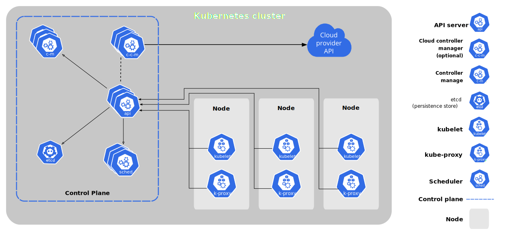
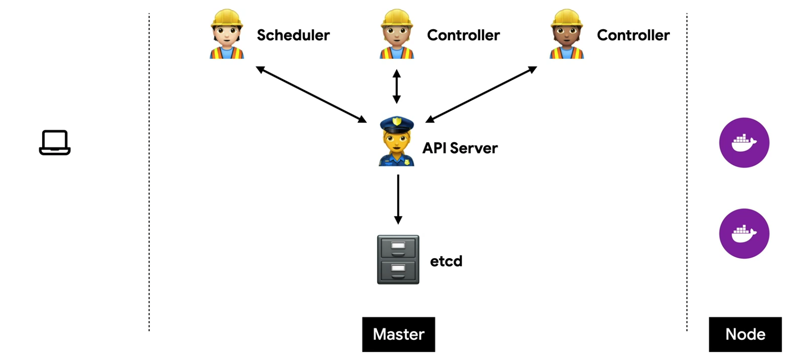
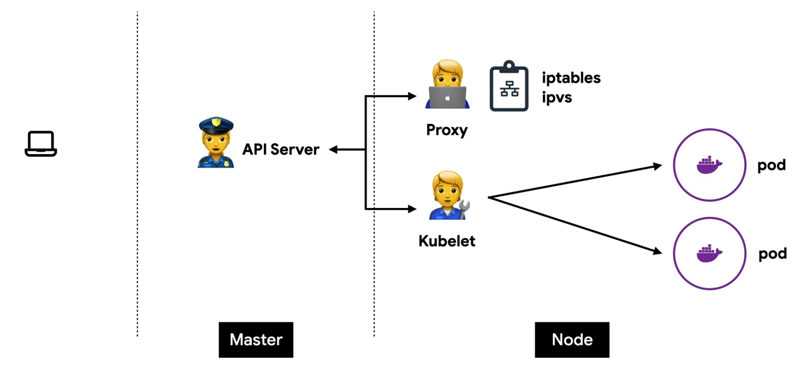
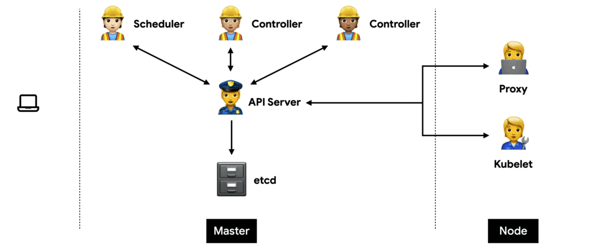
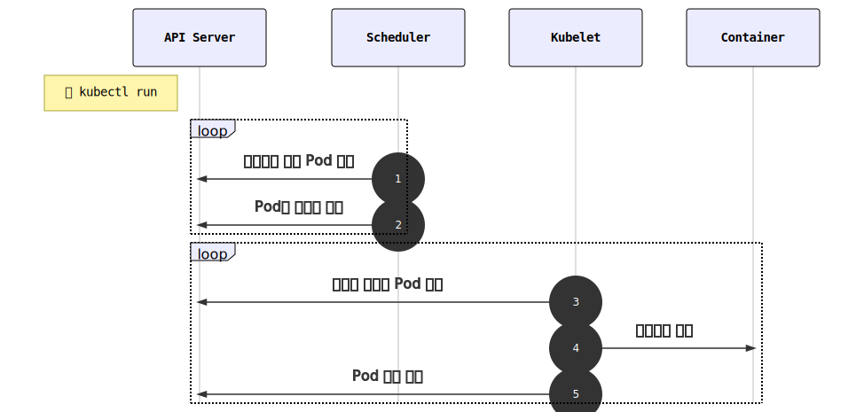
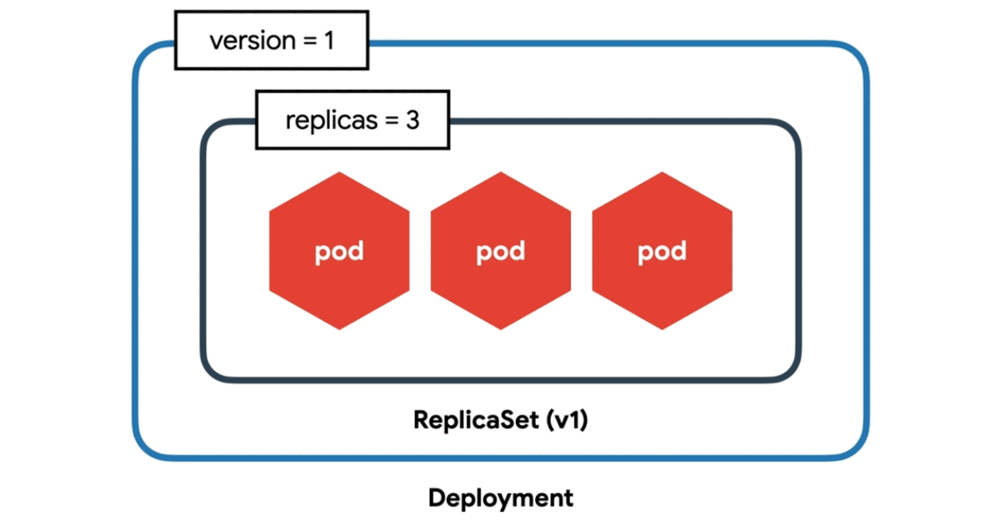
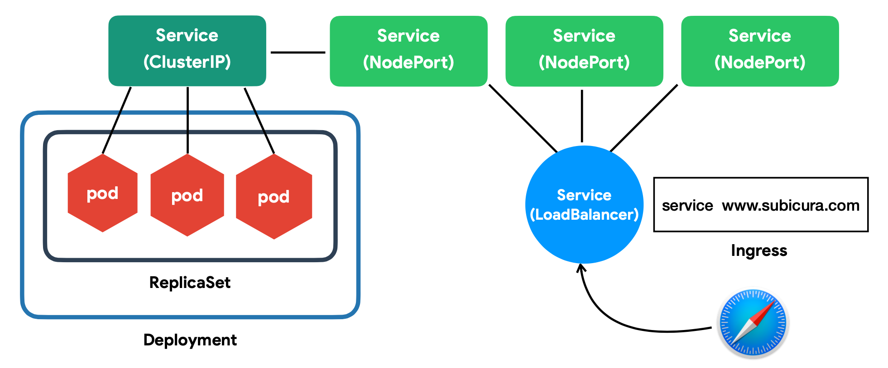
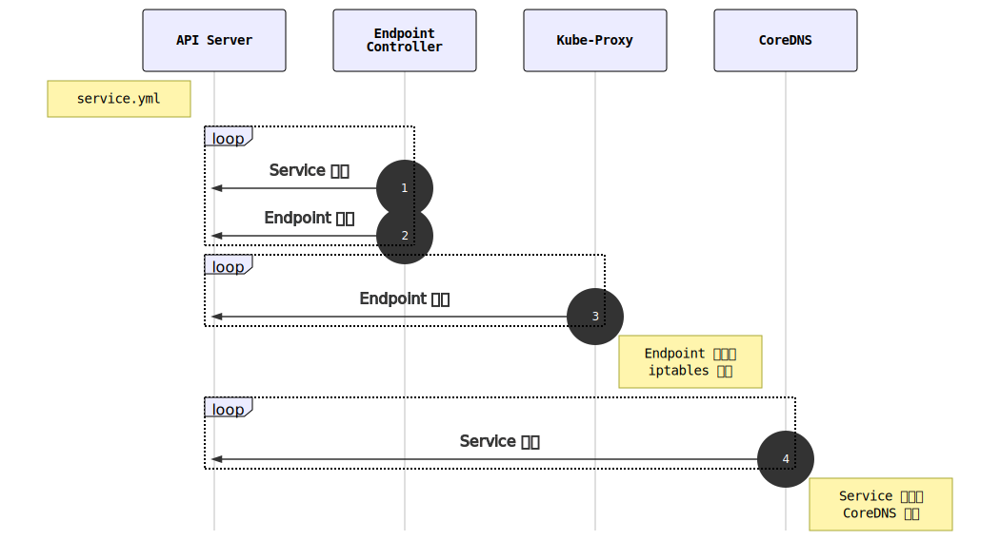
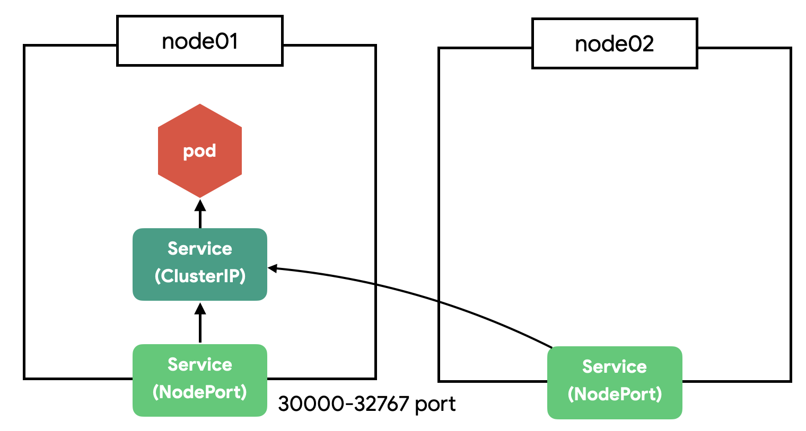
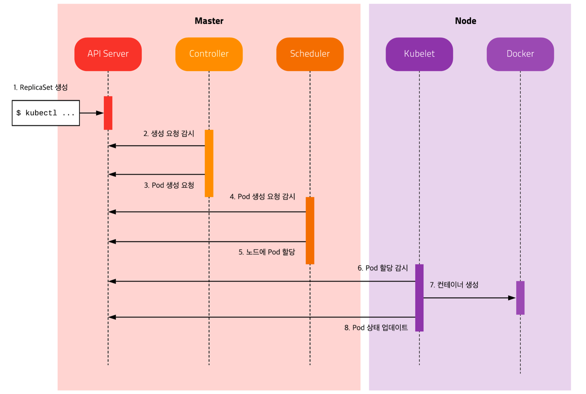

# Kubernetes

컨테이너를 쉽고 빠르게 배포/확장하고 관리를 자동화해주는 오픈소스 플랫폼.

- 당시 1주에 20억개의 컨테이너를 생성하던 구글이 만듦.
- 컨테이너 배포 시스템으로 사용하던 **borg**를 기반으로 만듦.
- 현재는 CNCF(Cloud Native Computing Foundation)라는 오픈소스 단체로 이관됨.

> 도커를 모른다면 쿠버네티스를 완벽하게 이해할 수 없다.

## Cloud Native?

> 클라우드 네이티브 기술은 조직이 퍼블릭, 프라이빗, 그리고 하이브리드 클라우드와 같은 현대적이고 동적인 환경에서 확장 가능한 애플리케이션을 개발하고 실행할 수 있게 해준다. 컨테이너, 서비스 메쉬, 마이크로서비스, 불변(Immutable) 인프라, 그리고 선언형(Declarative) API가 이러한 접근 방식의 예시들이다.
>
> 이 기술은 회복성, 관리 편의성, 가시성을 갖춘 느슨하게 결합된 시스템을 가능하게 한다. 견고한 자동화 기능을 함께 사용하면, 엔지니어는 영향이 큰 변경을 최소한의 노력으로 자주, 예측 가능하게 수행할 수 있다.
>
> Cloud Native Computing Foundation은 벤더 중립적인 오픈 소스 프로젝트 생태계를 육성하고 유지함으로써 해당 패러다임 채택을 촉진한다. 우리 재단은 최신 기술 수준의 패턴을 대중화하여 이런 혁신을 누구나 접근 가능하도록 한다.
>
> From [Cloud Native Definition v1.0](https://github.com/cncf/toc/blob/main/DEFINITION.md#%ED%95%9C%EA%B5%AD%EC%96%B4)

## [Container Orchestration](container-orchestration.md)

## 왜 Kubernetes인가?

- 오픈소스: 큰 회사들도 많이 참여하고 커뮤니티가 엄청 발달함.
- 엄청난 인기: 해외는 물론 국내 큰 회사들도 많이 사용함.
- 무한한 확장성
- 사실상의 표준(de facto)

쿠버네티스를 기반으로 만들어진 플랫폼 서비스도 많고, Cloud Native에서 지원하는 많은 부분들에 쿠버네티스가 중요한 역할을 함.

## 쿠버네티스 아키텍쳐

쿠버네티스를 배포하면 클러스터를 얻음.

클러스터는 노드의 집합. 노드는 컨테이너화된 애플리케이션을 실행하는 워커 머신의 집합. 모든 클러스터는 최소 한 개의 노드를 가짐.

노드는 팟을 호스트함. 컨트롤 플레인은 노드와 팟을 관리. 프로덕션 환경에서는 일반적으로 컨트롤 플레인이 여러 컴퓨터에 걸쳐 실행되고, 클러스터는 일반적으로 여러 노드를 실행.



출처: https://kubernetes.io/ko/docs/concepts/overview/components/

### Master(Control Plane)



#### etcd

분산형 키값 저장소.

- 모든 상태와 데이터 저장 (key-value 형태)
- 분산 시스템으로 구성해 가용성과 안전성을 높임
- TTL(Time To Live), watch 등 부가 기능 제공
- 백업 필수!

#### API Server(kube-apiserver)

쿠버네티스 API를 노출하는 컴포넌트. 컨트롤 플레인의 프론트엔드.

- 상태를 바꾸거나 조회하는 모듈
- etcd와 통신하는 유일한 모듈
- REST API 형태로 제공
- 권한 체크 후 적절한 권한 없을 시 요청 차단
- 관리자 요청 및 다양한 내부 모듈과 통신
- 수평으로 확장할 수 있도록 디자인

#### Scheduler(kube-scheduler)

어느 노드에 여유가 있는지 확인해 컨테이너를 배치하는 컴포넌트.

- 새로 생성된 Pod을 감지하고 실행할 노드를 선택
- 노드의 현재 상태와 Pod의 요구사항을 체크
  - 노드에 라벨 부여 (예: a-zone, b-zone, gpu-enabled 등)

#### Controller

kube-contoller-manager 컴포넌트에 의해 실행되는 프로세스.

컨테이너의 상태를 확인하고 원하는 상태(Desired State)를 유지하는 역할

- Desired State 유지
  - Observe: 상태 체크 (Current State == Desired State)
  - Diff: 차이점 발견 (Current State != Desired State)
  - Act: 조치 (Current State => Desired State)
- 논리적으로 다양한 컨트롤러 존재 (Replication, Node, Endpoint 등)
- 복잡성을 낮추기 위해 하나의 프로세스로 실행

### Node



#### Kubelet

팟에서 컨테이너가 확실하게 동작하도록 관리하는 컴포넌트

- 각 노드에서 실행
- Pod을 실행/중지하고 상태를 체크
- CRI(Container Runtime Inteface)
  - 도커 말고도 다른 컨테이너 실행 환경이 있는데, 이를 Pod으로 감싸서 사용

#### Proxy(kube-proxy)

각 노드에서 실행되는 네트워크 프로시로 노드의 네트워크 규직을 관리하는 컴포넌트. 쿠버네티스의 서비스 개념의 구현부.

- 네트워크 프록시와 부하 분산 역할
- 성능상의 이유로 별도의 프록시 프로그램 대신 iptables 또는 IPVS를 사용 (설정만 관리)

### 쿠버네티스 흐름



### Addons

- CNI (네트워크)
- DNS (도메인, 서비스 디스커버리)
- 대시보드 (시각화)

## Objects

쿠버네티스 시스템 안에서 클러스터의 상태를 표현하기위해 사용되는 영속적인 엔터티. 이 엔터티들이 다음을 서술할 수 있음

- 어떤 컨테이너화 된 애플리케이션들이 어느 노드에서 실행되고 있는지
- 이 애플리케이션들이 사용 가능한 리소스들
- 재시작, 업그레이드, 장애 허용같이 이 애플리케이션들이 어떻게 동작해야할지에 대한 정책들

## Workloads

쿠버네티스에서 구동되는 애플리케이션. 워크로드가 하나의 컴포넌트든 여러 컴포넌트가 함께하든, 쿠버네티스에서는 애플리케이션을 팟 집합 내에서 실행함.

각각의 팟을 직접 관리하는 대신 워크로드 리소스 사용 가능.

## Pod

- 가장 작은 배포 단위
- 전체 클러스터에서 고유한 IP 할당
- 여러 컨테이너가 하나의 팟에 속할 수 있음
  - 호스트 디렉토리나 로컬호스트 네트워크를 공유할 수 있음


이미지 출처: [Pod 생성 분석 | 쿠버네티스 안내서](https://subicura.com/k8s/guide/pod.html#pod-%E1%84%89%E1%85%A2%E1%86%BC%E1%84%89%E1%85%A5%E1%86%BC-%E1%84%87%E1%85%AE%E1%86%AB%E1%84%89%E1%85%A5%E1%86%A8)

`kubectl run` 명령을 이용해 팟을 생성하기도 하지만, 대부분 YAML 파일로 많이 만듦.

### [Pod 라이프사이클](https://kubernetes.io/ko/docs/concepts/workloads/pods/pod-lifecycle/)

### 컨테이너 상태 모니터링

`컨테이너 생성`과 `서비스 준비`는 서로 다른 상태. 컨테이너를 생성했다해도 워크로드가 모두 준비되서 동작 가능할 때까지는 초기화 시간이 필요함. 쿠버네티스는 이 `서비스 준비` 상태를 체크하는 옵션을 제공.

- 보통 livenessProbe와 readinessProbe를 같이 적용함. 상세한 설정은 애플리케이션 환경에 따라 적절히 조절.

#### livenessProbe

컨테이너가 정상적으로 동작하는지 체크하고 정상적으로 동작하지 않는다면 컨테이너를 재시작하여 문제를 해결.

```yaml
apiVersion: v1
kind: Pod
metadata:
  name: echo-lp
  labels:
    app: echo
spec:
  containers:
    - name: app
      image: ghcr.io/subicura/echo:v1
      livenessProbe: # HTTP GET 요청을 보내 생존 여부 체크
        httpGet:
          path: /does/not/exist
          port: 8080
        initialDelaySeconds: 5
        timeoutSeconds: 2 # Default 1
        periodSeconds: 5 # Defaults 10
        failureThreshold: 1 # Defaults 3

# NAME      READY   STATUS             RESTARTS      AGE
# echo-lp   0/1     CrashLoopBackOff   4 (24s ago)   69s

# Events:
#   Type     Reason     Age                From               Message
#   ----     ------     ----               ----               -------
#   Normal   Scheduled  96s                default-scheduler  Successfully assigned default/echo-lp to minikube
#   Warning  BackOff    76s (x2 over 76s)  kubelet            Back-off restarting failed container
#   Normal   Pulled     56s (x5 over 95s)  kubelet            Container image "ghcr.io/subicura/echo:v1" already present on machine
#   Normal   Created    56s (x5 over 95s)  kubelet            Created container app
#   Normal   Started    56s (x5 over 95s)  kubelet            Started container app
#   Warning  Unhealthy  56s (x4 over 86s)  kubelet            Liveness probe failed: Get "http://172.17.0.3:8080/does/not/exist": dial tcp 172.17.0.3:8080: connect: connection refused
#   Normal   Killing    56s (x4 over 86s)  kubelet            Container app failed liveness probe, will be restarted
```

#### readinessProbe

컨테이너 준비 여부 체크 후 준비되지 않으면 팟으로 들어오는 요청을 제외. livenessProbe는 재시작하지만 readinessProbe는 요청만 제외시킴.

```yaml
apiVersion: v1
kind: Pod
metadata:
  name: echo-rp
  labels:
    app: echo
spec:
  containers:
    - name: app
      image: ghcr.io/subicura/echo:v1
      readinessProbe: # HTTP GET 요청을 보내 생존 여부 체크
        httpGet:
          path: /does/not/exist
          port: 8080
        initialDelaySeconds: 5
        timeoutSeconds: 2 # Default 1
        periodSeconds: 5 # Defaults 10
        failureThreshold: 1 # Defaults 3

# NAME      READY   STATUS    RESTARTS   AGE
# echo-rp   0/1     Running   0          8s

# Events:
#   Type     Reason     Age               From               Message
#   ----     ------     ----              ----               -------
#   Normal   Scheduled  27s               default-scheduler  Successfully assigned default/echo-lp to minikube
#   Normal   Pulled     26s               kubelet            Container image "ghcr.io/subicura/echo:v1" already present on machine
#   Normal   Created    26s               kubelet            Created container app
#   Normal   Started    26s               kubelet            Started container app
#   Warning  Unhealthy  2s (x4 over 17s)  kubelet            Readiness probe failed: Get "http://172.17.0.3:8080/does/not/exist": dial tcp 172.17.0.3:8080: connect: connection refused
```

### 다중 컨테이너

하나의 팟에 속한 컨테이너는 네트워크를 localhost로 공유하고, 디렉토리 또한 공유할 수 있음.

```yaml
apiVersion: v1
kind: Pod
metadata:
  name: counter
  labels:
    app: counter
spec:
  containers:
    - name: app
      image: ghcr.io/subicura/counter:latest
      env:
        - name: REDIS_HOST
          value: "localhost"
    - name: db
      image: redis
```

## Workload Resources

사용자를 대신해 팟 집합을 관리하는 리소스. 컨트롤러(지정한 상태와 일치하도록 올바른 수와 유형의 팟이 실행되고 있는지 확인)를 구성.

### ReplicaSet

- 여러개의 팟을 관리
  - 신규 팟을 생성하거나, 기존 팟을 제거해 원하는 수(Replicas)를 유지
  - 레이블을 이용해 팟을 체크함. 레이블이 겹치지 않게 신경써야함.
- 다만 실전에서 ReplicaSet이 단독으로 사용되는 일은 거의 없음. ReplicaSet을 관리하는 Deployment를 주로 사용함.

```yaml
apiVersion: apps/v1
kind: ReplicaSet
metadata:
  name: echo-rs
spec:
  replicas: 1 # 몇 개의 팟을 유지할건지
  selector: # 관리 대상인 팟을 무엇으로 구분할지
    matchLabels:
      app: echo
      tier: app
  template:
    metadata:
      labels:
        app: echo
        tier: app
    spec:
      containers:
        - name: echo
          image: ghcr.io/subicura/echo:v1
# NAME                READY   STATUS    RESTARTS   AGE     LABELS
# pod/echo-rs-pw2ll   1/1     Running   0          3m41s   app=echo,tier=app
#
# NAME                      DESIRED   CURRENT   READY   AGE     LABELS
# replicaset.apps/echo-rs   1         1         1       3m41s   <none>
```

### Deployment

- 내부적으로 ReplicaSet을 이용해 배포 버전을 관리



```yaml
apiVersion: apps/v1
kind: Deployment
metadata:
  name: echo-deploy
spec:
  replicas: 4
  selector:
    matchLabels:
      app: echo
      tier: app
  template:
    metadata:
      labels:
        app: echo
        tier: app
    spec:
      containers:
        - name: echo
          image: ghcr.io/subicura/echo:v1
# NAME                               READY   STATUS    RESTARTS   AGE
# pod/echo-deploy-77dbb94b69-ft5p2   1/1     Running   0          71s
# pod/echo-deploy-77dbb94b69-fvjnq   1/1     Running   0          71s
# pod/echo-deploy-77dbb94b69-kt8jz   1/1     Running   0          71s
# pod/echo-deploy-77dbb94b69-nplhl   1/1     Running   0          71s
#
# NAME                          READY   UP-TO-DATE   AVAILABLE   AGE
# deployment.apps/echo-deploy   4/4     4            4           71s
#
# NAME                                     DESIRED   CURRENT   READY   AGE
# replicaset.apps/echo-deploy-77dbb94b69   4         4         4       71s

# 이미지 태그를 v2로 변경하고 재배포한 결과
# NAME                               READY   STATUS    RESTARTS   AGE
# pod/echo-deploy-665857f7dd-48fwd   1/1     Running   0          10s
# pod/echo-deploy-665857f7dd-6jmjd   1/1     Running   0          10s
# pod/echo-deploy-665857f7dd-7dmpx   1/1     Running   0          4s
# pod/echo-deploy-665857f7dd-r9bwr   1/1     Running   0          5s
#
# NAME                          READY   UP-TO-DATE   AVAILABLE   AGE
# deployment.apps/echo-deploy   4/4     4            4           92s
#
# NAME                                     DESIRED   CURRENT   READY   AGE
# replicaset.apps/echo-deploy-665857f7dd   4         4         4       10s
# replicaset.apps/echo-deploy-77dbb94b69   0         0         0       92s
```

`kubectl rollout` 명령을 이용해 히스토리를 확인할 수 있고, 손쉽게 롤백할 수 있음.

```bash
kubectl rollout history deployment/echo-deploy
kubectl rollout history deployment/echo-deploy --revision
kubectl rollout undo deployment/echo-deploy
kubectl rollout undo deployment/echo-deploy --to-revision=2
```

### 그 외

https://kubernetes.io/ko/docs/concepts/workloads/controllers/

- Daemon Set
  - 모든 노드에 꼭 하나씩만 떠있길 원하는 팟을 만들 때 사용
  - 예) 데이터, 로그 수집
- Stateful Set
  - 순차적인 팟 실행, 볼륨 재활용 등에 사용
- Job / CronJob
  - 한 번 실행하고 죽는 팟
  - CronJob은 Job을 [Cron](https://ko.wikipedia.org/wiki/Cron) 형식으로 쓰여진 주어진 일정에 따라 주기적으로 반복

### Service, LoadBalancer, Network

> 쿠버네티스에서 서비스는 팟의 논리적 집합과 그것들에 접근할 수 있는 정책을 정의하는 추상적 개념이다.
>
> From [서비스 | Kubernetes](https://kubernetes.io/ko/docs/concepts/services-networking/service/)

팟은 자체 IP를 가짐. 그래서 팟끼리 직접 통신할 수 있지만, 쉽게 생성되고 사라지는 특성 때문에 이는 위험함. 이를 해결하기 위해 고정된 IP를 가진 서비스를 두고 이를 통해 통신.

서비스가 대상으로 하는 팟 집합은 일반적으로 셀렉터가 결정.

팟의 노출 범위에 따라 ClusterIP, NodePort, LoadBalancer로 나뉨.

https://kubernetes.io/ko/docs/concepts/services-networking/



서비스의 레이블 이름은 [RFC 1035](https://kubernetes.io/ko/docs/concepts/overview/working-with-objects/names/#rfc-1035-label-names)에 정의된 DNS 레이블 표준을 따라야함.

#### Service - ClusterIP

- 클러스터 내부에서 사용하는 프록시
- 팟은 동적이지만 서비스는 고유 IP를 가짐
- 클러스터 내부에서 서비스 연결은 DNS를 이용
  - 서비스의 이름이 내부 DNS에 등록되서 이를 도메인으로 접근이 가능해짐

|          Field          |                   Description                    |
| :---------------------: | :----------------------------------------------: |
|    `spec.ports.port`    |               서비스가 오픈할 포트               |
| `spec.ports.targetPort` | 서비스가 접근할 팟의 포트 (기본값은 port와 동일) |
|     `spec.selector`     |        서비스가 접근할 팟의 레이블 선택자        |

```yaml
apiVersion: v1
kind: Service
metadata:
  name: redis
spec:
  ports:
    - port: 6379
      protocol: TCP
  selector:
    app: counter
    tier: db
```



#### Service - NodePort

- 노드(host)에 노출되어 외부에서 접근 가능한 서비스
  - 클러스터의 모든 노드에 포트를 오픈
  - 여러 개의 노드가 있다면 아무 노드로 접근해도 지정한 팟으로 접근
- NodePort는 ClusterIP의 기능을 포함함.
- 노드가 사라졌을 때 자동으로 다른 노드를 통해 접근이 불가능함.



#### Service - LoadBalancer

- 하나의 IP주소를 외부에 노출
- 로드밸런서에 요청하면 알아서 살아있는 노드에 접근함.

**현재와 같은 구조라면 앱이 추가될 때마다 로드밸런서를 추가해야함.** 이를 해결하기 위해 Ingress를 사용함.

#### Ingress

클러스터의 애플리케이션이 늘어날 때마다 해당 애플리케이션의 포트를 위한 서비스도 늘어나야함. 이를 편하게 하기위해 인그레스가 나옴.

- 같은 IP와 Port로 접근해도 도메인 또는 경로별 라우팅

### 그 외 기본 오브젝트

- Volume: Storage (EBS, NFS, ...)
- Namespace: 논리적인 리소스 구분
- ConfigMap/Secret: 설정
- ServiceAccount: 권한 계정
- Role/ClusterRole: 권한 설정(get, list, watch, create, ...)

### API 호출

원하는 상태(desiged state)를 다양한 오브젝트(object)로 명세(spec)를 작성해 API 서버에 YAML 형식으로 전달



## 실습 환경

https://subicura.com/k8s/prepare/kubernetes-setup.html

- minikube or k3s
- kubectl

### [minikube](https://minikube.sigs.k8s.io/docs/)

minikube는 VM, Container, Bare-metal에 모두 배포할 수 있지만, 서로 다른 환경들과 상호작용하기 위한 일관된 방법을 제공하기 위해 [Docker Machine](https://github.com/docker/machine) 라이브러리를 사용함.

docker 드라이버를 사용한다면 쿠버네티스 네트워크에 접근할 때 별도의 포트를 프록시하여 사용해야함.

```bash
# 로컬 클러스터의 서비스에 접근하기 위한 URL을 반환하는 명령
minikube service [service-name]
```

## `kubectl` Commands

### `apply`

쿠버네티스 클러스터에 설정을 적용시키는 명령

```bash
kubectl apply -f [yaml/file/path.yml]
```

### `get`

리소스들을 조회하는 명령

```bash
kubectl get all
kubectl get pod
kubectl get po, service

# 결과 포맷 변경
kubectl get pod -o wide
kubectl get pod -o yaml
kubectl get pod -o json

# 레이블 표시
kubectl get pod --show-labels
```

### `describe`

쿠버네티스에 선언된 리소스의 상세한 상태를 확인하는 명령

```bash
kubectl describe [type]/[name]
kubectl describe po/wordpress-5cf6c98486-twmrc
```

여기서 Events 항목을 확인할 수 있는데, 해당 팟에게 발생한 일들을 확인할 수 있음. 이를 통해 원하는 대로 팟이 안뜨거나 할 때 원인 분석 가능.

### `delete`

쿠버네티스에 선언된 리소스를 삭제하는 명령

```bash
kubectl delete [type]/[name]
kubectl delete po/wordpress-5cf6c98486-twmrc
```

### `logs`

팟, 컨테이너의 로그를 확인하는 명령

```bash
kubectl logs [pod-name]
# 특정 컨테이너의 로그
kubectl logs [pod-name] -c [container-name]
```

### `exec`

컨테이너에 명령을 실행하는 명령

```bash
kubectl exec [-it] [pod-name] -- [command]
kubectl exec -it wordpress-5cf6c98486-twmrc -- bash
```

### `config`

여러 개의 쿠버네티스 클러스터 컨텍스트를 저장하고 필요에 따라 선택 가능.

```bash
kubectl config current-context
kubectl config use-context minikube
```

### `run`

`docker run` 명령처럼 이미지를 기반으로 팟을 생성시키는 명령

```bash
kubecel run [pod-name] --image=[image-path]
```

`--env`, `-it` 등 `docker run`과 비슷한 다양한 옵션 사용 가능.

하지만 대부분 `run` 명령보다 YAML 파일을 더 많이 사용함.

### 그 외

- `api-resources` : 서버에서 지원하고 있는 API 리소스들을 나열. 여기서 리소스들의 shortname 확인 가능.
- `explain` : 특정 오브젝트 설명 보기

## [YAML](yaml.md)

쿠버네티스의 YAML 파일에는 다음 4가지 필수요소가 있음.

|    Field     |                  Description                  |                Examples                 |
| :----------: | :-------------------------------------------: | :-------------------------------------: |
| `apiVersion` | 이 오브젝트를 생성하기 위해 사용하는 API 버전 |  v1, app/v1, networking.k8s.io/v1, ...  |
|    `kind`    |         생성하고자 하는 오브젝트 종류         | Pod, ReplicaSet, Deployment, Service 등 |
|  `metadata`  |     오브젝트를 유일하게 구분지어줄 데이터     |         name, uid, namespace 등         |
|    `spec`    |    오브젝트에 대해 어떤 상태를 의도하는지     |         오브젝트 종류마다 다름          |

## 더 공부해볼 범위

- 다양한 환경별 특징 (Bare metal, EKS, ...)
- 쿠버네티스 패턴 (사이드카, 어댑터, ...)
- 관련 생태계 (서비스메시, 서버리스, ...)
- GitOps CI/CD
- 승인제어 등 고급 기능

## 참고자료 및 이미지 출처

- [초보를 위한 쿠버네티스 안내서 - 44BITS](https://youtube.com/playlist?list=PLIUCBpK1dpsNf1m-2kiosmfn2nXfljQgb)
- [초보를 위한 쿠버네티스 안내서 - 인프런](https://www.inflearn.com/course/%EC%BF%A0%EB%B2%84%EB%84%A4%ED%8B%B0%EC%8A%A4-%EC%9E%85%EB%AC%B8)
- [쿠버네티스 안내서](https://subicura.com/k8s/)
- [쿠버네티스 문서](https://kubernetes.io/ko/docs/home/)
