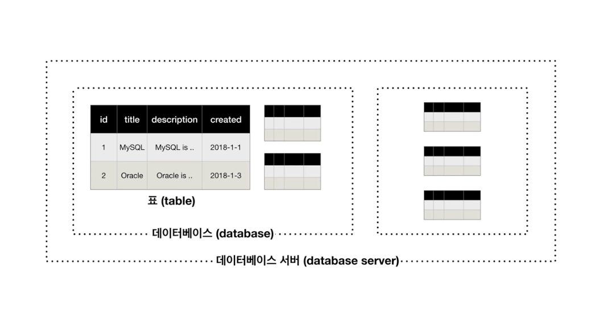

# MySQL

[MySQL 개발자 페이지](https://dev.mysql.com/)

## 설치 및 기본 사용법

### 설치

맥OS용 패키지로 설치하려 했으나 다운로드 경로를 못찾아서 `brew`로 설치

```bash
$ brew install mysql # 최신버전. 특정 버전은 뒤에 @5.5 포맷으로 버전 붙이면 됨
```

### 초기 설정

설치하면 이렇게 안내가 나옴

```text
==> mysql
We've installed your MySQL database without a root password. To secure it run:
    mysql_secure_installation

MySQL is configured to only allow connections from localhost by default

To connect run:
    mysql -uroot

To have launchd start mysql now and restart at login:
  brew services start mysql
Or, if you don't want/need a background service you can just run:
  mysql.server start
```

쉘에 `mysql_secure_installation` 명령어를 실행하면 설정 시작.

- 비밀번호 복잡하게 할래?
- 비밀번호 뭐로 할래?
- anonymous 사용자 지울래?
- 원격에서 root 로그인하는거 막을래?
- 테스트 데이터베이스 지울래?
- 변경된 권한을 테이블에 적용할래?

** `mysql_secure_installation`을 실행했는데 오류가 난다?**

```text
Error: Can't connect to local MySQL server through socket '/tmp/mysql.sock' (2)
```

MySQL 서버와 연결이 안된다고 한다. 원인은 여러가지인데, 나는 MySQL 서버를 실행시키지 않은 상태였다.

```bash
brew services start mysql
```

### 접속

```bash
mysql -u root -p
Enter password:
```

옵션으로 host(-h), port(-P) 등 추가 가능.

#### 접속 후 비밀번호 변경

```sql
SET PASSWORD = PASSWORD('new-password');
```

## MySQL의 구조



MySQL에서는 Database와 Schema를 동의어로 사용함.

> [CREATE DATABASE creates a database with the given name. To use this statement, you need the CREATE privilege for the database. CREATE SCHEMA is a synonym for CREATE DATABASE.](https://dev.mysql.com/doc/refman/8.0/en/create-database.html)

MySQL 서버에 접속할 수 있는 클라이언트로는 기본적으로 제공되는 MySQL Monitor라는 CUI 프로그램이 있고, 이 외에도 MySQL Workbench 등 굉장히 다양함.

## SQL이란?

**S**tructured **Q**uery **L**anguege

구조화된 질문 언어. 읽히는대로 풀어보면 구조가 잘 짜여진 질문을 하기위한 언어 정도. 데이터베이스에 질문하기위한, 정보를 요청하기 위한 언어.

## DATABASE 관련 명령

### 생성

```sql
CREATE DATABASE database_name;
```

### 조회

```sql
SHOW DATABASES;
```

### 사용

```sql
USE database_name;
```

### 삭제

```sql
DROP DATABASE database_name;
```

## TABLE 관련 명령

DDL(**D**ata **D**efinition **L**anguage). 단어 그대로 데이터를 정의하는 언어. 각각의 컬럼이 어떤 특성을 갖고 있으며, 다른 테이블과 어떤 관계를 맺고 있는지 표현 가능.

- [ ] [Atomic DDL은 뭐지?](https://dev.mysql.com/doc/refman/8.0/en/atomic-ddl.html)

### 생성

```sql
CREATE TABLE table_name(
    column_name column_type [options]\
    ...
);
```

컬럼 타입 옆에 넣어주는 숫자는 타입마다 의미가 다름. 정수형(예: `INT(11)`)은 최대 출력 가능 길이. 정수형의 최대 출력 가능 길이의 한계는 255.

[CREATE TABLE Statement - MySQL](https://dev.mysql.com/doc/refman/8.0/en/create-table.html)<br/>
[Data Types - MySQL](https://dev.mysql.com/doc/refman/8.0/en/data-types.html)

#### 많이 쓰는 COLUMN 옵션들

- `NULL`, `NOT NULL`
- `DEFAULT`
- `AUTO_INCREMENT`

### 상세 정보 조회

```sql
DESC table_name;
```

### 이름 변경

```sql
RENAME TABLE old_table TO new_table;
ALTER TABLE old_table RENAME new_table;
```

## DATA 관련 명령

DML(Data Manipulation Language). 데이터를 조작하고 다루는 언어. 데이터의 CRUD 동작들을 서술.

### 삽입

```sql
INSERT INTO table (column_1[, column_2...])
  VALUES (column_1_value[, column_2_value...])[, (column_1_value[, column_2_value...])];
```

[INSERT Statement - MySQL](https://dev.mysql.com/doc/refman/8.0/en/insert.html)

### 조회

```sql
SELECT column[, column]
FROM table
WHERE condition_expr
ORDER BY column ASC|DESC
LIMIT row_count OFFSET offset;
```

[SELECT Statement - MySQL](https://dev.mysql.com/doc/refman/8.0/en/select.html)

### 수정

```sql
UPDATE table
SET column = value[, column = value]
WHERE condition_expr;
```

[UPDATE Statement - MySQL](https://dev.mysql.com/doc/refman/8.0/en/update.html)

### 삭제

```sql
DELETE FROM table
WHERE condition_expr;
```

[DELETE Statement - MySQL](https://dev.mysql.com/doc/refman/8.0/en/delete.html)

# OPERATOR

## BETWEEN A AND B

A와 B를 포함한 범위에 속하는지 판별

# EXPLAIN

쿼리의 실행 계획을 알고 싶을 때 사용하는 명령어. 쿼리의 앞에 붙여주면 됨.

```sql
EXPLAIN
SELECT column[, column]
FROM table
```

EXPLAIN을 JSON 포맷으로 보면 더 많은 정보를 알 수 있음.

```sql
EXPLAIN FORMAT=JSON
SELECT column[, column]
FROM table
```

# Data Type

## Enum

Enum은 String 타입의 일종. 테이블 생성 시 컬럼 명세에 명시적으로 나열된 값들만 허용하는 문자열 객체.

문자열과 인덱스(졍수) 2가지 데이터 사용 가능함. 일반적인 상황에서는 문자열 데이터가 사용되지만, 정수 데이터로 사용될 수 있음.

```sql
# 예: duration이 enum 타입
SELECT DATE_ADD(lesson_at, INTERVAL duration MINUTE) # 이 경우 인덱스가 사용됨
SELECT DATE_ADD(lesson_at, INTERVAL duration HOUR_MINUTE) # 이 경우 문자열이 사용됨

# 명시적으로 표현하기 위해 CAST를 써줌
DATE_ADD(lesson_at, INTERVAL CAST(duration AS CHAR) MINUTE)
```

# 참고자료

[DATABASE2 - MySQL - 생활코딩](https://opentutorials.org/course/3161)
