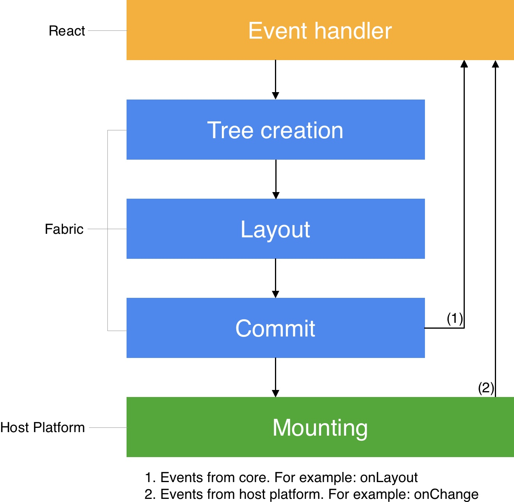

# React Native

React를 기반으로 하는 iOS, Andrdoid 크로스플랫폼 애플리케이션 프레임워크.

## 동작 원리

단순 웹뷰나 브라우저 위에서 리액트 코드가 실행되는 것이 아님. 과거에는 리액트 네이티브 코드와 네이티브 API 사이에 Bridge가 있어서 렌더링 요청을 중계해줬음. 지금은 Fabric이라는 새로운 렌더러로 바뀜.

리액트 로직을 호스트 플랫폼에 렌더링 하는 작업을 `Render pipeline`이라고 함. 이 렌더 파이프라인은 세 단계로 쪼갤 수 있음.

1. Render: 리액트는 자바스크립트로 된 [React Element Trees](https://reactnative.dev/docs/architecture-glossary#react-element-tree-and-react-element)를 생성하는 제품 로직을 실행함. 렌더러는 이 트리로부터 C++로 된 [React Shadow Tree](https://reactnative.dev/docs/architecture-glossary#react-shadow-tree-and-react-shadow-node)를 생성.
1. Commit: React Shadow Tree가 완전히 생성된 후, 렌더러가 커밋을 발생시킴. 이는 React Element Tree와 새로 생성된 React Shadow Tree를 마운트될 "다음 트리"로 격상시킴.
1. Mount: 레이아웃 계산 결과와 함께 React Shadow Tree는 [Host View Tree](https://reactnative.dev/docs/architecture-glossary#host-view-tree-and-host-view) 속으로 변환됨.

렌더 파이프라인의 각 단계는 상황마다 다른 스레드에서 발생할 수 있음. 자세한 내용은 [Threading model](https://reactnative.dev/docs/threading-model) 참조

- 참조: https://reactnative.dev/docs/render-pipeline

## Tools

### [Expo](https://expo.dev/)

모든 리액트 앱(리액트 네이티브 포함)을 위한 프레임워크이자 플랫폼. 동일한 자바스크립트 혹은 타입스크립트 코드로 iOS, Android, Web 앱의 개발, 빌드, 배포 사이클을 빠르게 반복할 수 있도록 도와주는 리액트 네이티브와 네이티브 플랫폼들에 기반한 도구와 서비스들의 집합.
